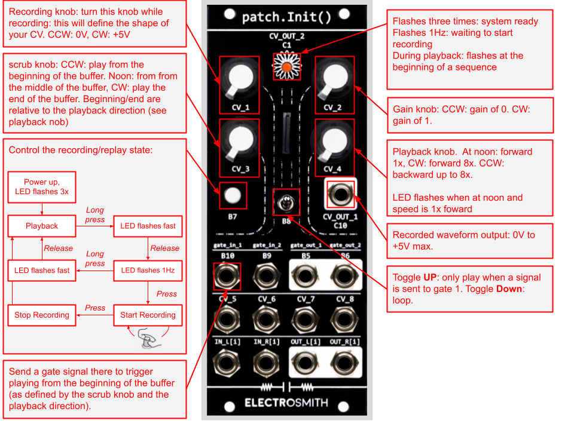

# patch.init
 Electrosmith's patch.Init() projects

## util/

- `util.h`: `LOG_{INFO,WARN,ERROR,FATAL}` helper functions. Logging
  can be entirely disabled by not defining the `LOG_ON` macro
  (default). `f2a` methods help convert a float to a string for
  logging, with `FLOAT_PRECISION` digits. Really useful:
  `LOG_INFO_EVERY_MS` which allows you to print something at an
  internval in milli-seconds.

  Offers some simplified printing of floating point values:

  ```
  float f = 1.2;
  LOG_INFO("f=%s", f2a(f));
  ```

  If you need to print several values in one `LOG_*` statement:

  ```
  FB(b1); FB(b2);
  float f1 = 1.2;
  float f2 = 1.3;
  LOG_INFO("f1=%s, f2=%s", f2a(f1, b1), f2a(f2, b2));
  ```

- `knobs.h`: Create individual `Knob` class instances with range
   compentation. `PrintIfChange` and methods allow you to obtain a
   reading of the knobs and can be used to adjust compensation values
   to your own device (use the raw values for the knob fully CCW, at
   mid course and fully CW.) Then you can read fully compensated and
   scalled output and get an indication that the value has changed
   according to a chosen precision.

- `led.h`: Use to control the visible LED
  (`CV_OUT_2`/`C1`). `MemorizeVoltage()` and
  `RestoreMemorizedVoltage()` methods can be used to share the LED
  between implemented functionalities. The LED can for instance be
  used to meter a value (via the emitted light intensitty) then
  temporarily made to flash to indicate that a button is pressed and
  restored to its previous light intensity value.

  The input range (which can be choosen at instanciation time) is
  translated to a voltage that actually lights to LED from dimmest to
  brighest. Compensation values for your device can vary but are easy
  to measure.

- `transcaler.h`: Used to translate a scale a value from [v1, v2] to
  [V1, V2] in a linear fashion. Extremely handy to rectify the
  pentiometer values that are never exactly at 0.0 CCW, 1.0 CW and 0.5
  at their middile position or to properly drive the `LED` device
  described above.

- `cv.h`: Define the `CVIn` and `CVOut` classes. `CVOut` instances are
  compensated for their offset to truly map from -5.0v to +5.0V.

- `push_button.h`: An instance of the `OnOffPushButton` class will
  tell you whether the patch.Init() push button is in the `OFF` or
  `ON` state and whether the last press was a long (>1 sec) press. a
  `LED` instance can be attached and the faceplate LED will rapidely
  flash when the button has been pressed for more than 1 second.

## CV/

Demo code emitting a square wave on the CV out whose frequency is
controlled by the first knob.

## Knobs/

Monitor the values of all four knobs and print when a change in value
occurs (when a knob was turned.)

## Switches/

Map the state of the faceplate LED to the push button

## CVRecorder/

My first patch.Init() application: a control voltage recorder. Record
a CV using knob #1 and then replay it, adjusting its amplitude with
knob #2 and speed/direction of the replay with knob #4.

- Turn it on, the faceplate LED will flash three times to indicate the
  system is ready.

- Long press the push button, the LED starts flashing at 1Hz. Turn
  knob #1 to adjust the CV to the level at which you want to start the
  recording. If you have CV1 out connected (to for instance a VCF) you
  will be able to hear where you want your CV recording to start from.

- Press the push button: the LED lights up at half intensity and you
  can start moving knob #1 to generate and record a 0V to 5V control
  voltage. That control voltage is mirrored on CV1 out. Press the push
  button when you want to stop the recording.

- The CV sequence you recorded will start to be played immediately on
  CV1 out. The LED will flash each time a sequence starts. Knob #2
  controls the amplitude of the replayed CV sequence. Knob #3 allows
  you to advance to start of the replay in the recorded sequence and
  knob #4 the speed (1x to 4x forward or backward) of the replay. Turn
  the knob #4 CC to play forward (noon position is 1x, the LED will
  flash briefly when you're at 1x) and CCW to play backward.

  The CV sequence can also be restarted by applying a positive gate
  signal to the input gate #1.



Left TODO:

- Gate out on sequence start

- Use the toggle to switch to pick which wave is recorded and knob #1
  is then used to mix between the two wave forms.


